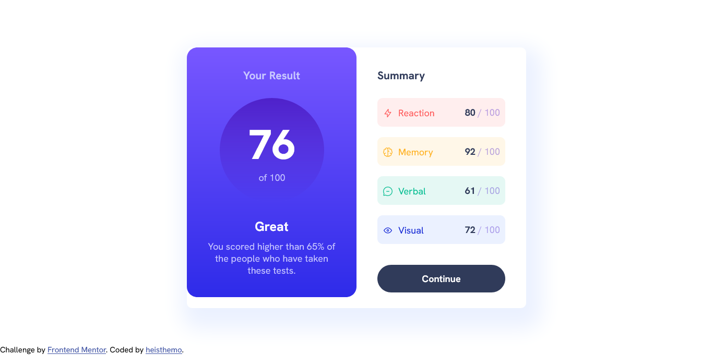
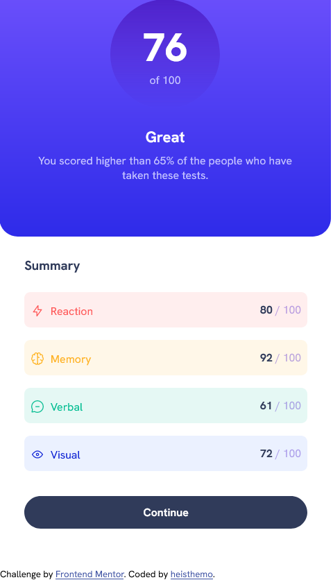

# Frontend Mentor - Results summary component solution

This is a solution to the [Results summary component challenge on Frontend Mentor](https://www.frontendmentor.io/challenges/results-summary-component-CE_K6s0maV). Frontend Mentor challenges help you improve your coding skills by building real projects.  

## Table of contents

- [Frontend Mentor - Results summary component solution](#frontend-mentor---results-summary-component-solution)
	- [Table of contents](#table-of-contents)
	- [Overview](#overview)
		- [Screenshots](#screenshots)
 		- [Links](#links)
		- [Built With](#built-with)
		- [What I learned?](#what-i-learned)
		- [Continued Development](#continued-development)
	- [Author](#author)
	- [Acknowledgements](#acknowledgements)

## Overview

### Screenshots

### Links 

Live URL: (https://gleaming-dasik-974d82.netlify.app/)

### Built With

- Semantic HTML5 markup
- CSS custom properties
- Flexbox

### What I learned?

Didn't really learn anything new building this project. I really took this project to reinforce my HTML CSS and SASS knowledge.

### Continued Development

In the future, I want to continue learning and implementing responsive design. I want to perfect using SASS mixins to implement responsive design.

## Author

- Frontend Mentor - [@heisthemo](https://www.frontendmentor.io/profile/heisthemo)
- Twitter - [@heisthemo](https://www.twitter.com/heisthemo)

## Acknowledgements 

Hats off to [@jonasschmedtmann](https://twitter.com/jonasschmedtman) for his course on Advanced CSS and SASS.
